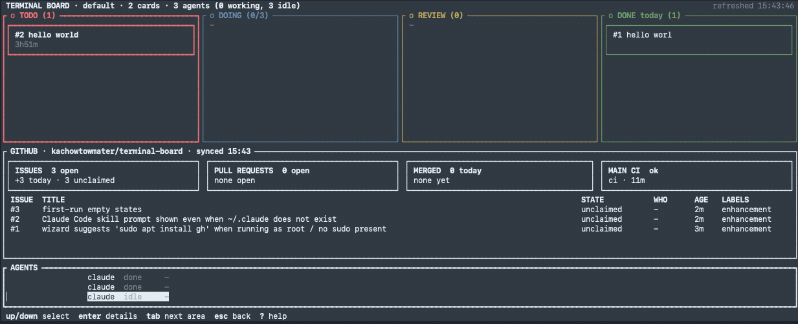
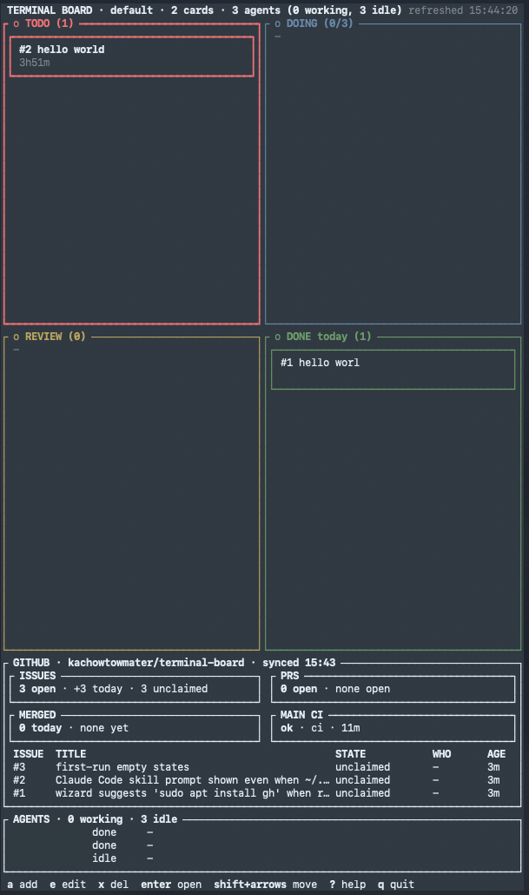
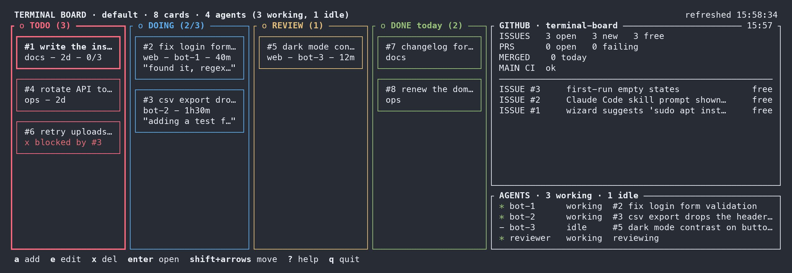
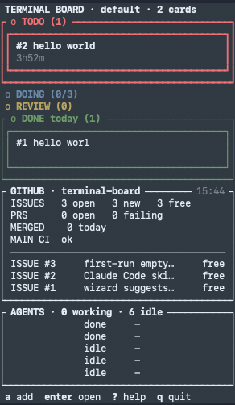
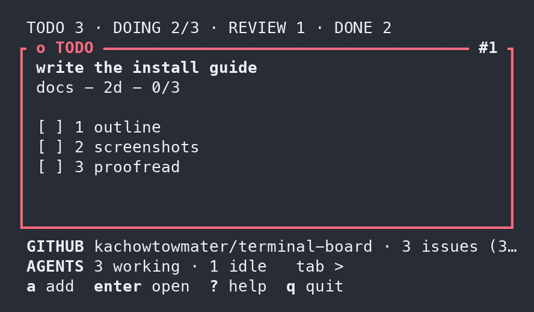

# Terminal Board

**Terminal Board** (`tb`) is a to-do board that lives in your terminal. It has four
columns — **TODO → DOING → REVIEW → DONE** — and you move cards across them as work
progresses. It is made to be shared: you, your teammates and your AI coding agents all use
the same board, from the same keyboard-driven screen or from simple commands. It can also
show your GitHub repository (open pull requests, issues, CI) right next to your cards, and
the live status of your agents.



**What you get**

- A four-column board you drive with the arrow keys: add, move, edit and finish cards.
- Cards with descriptions, checklists and notes, so every piece of work has its own history.
- Your GitHub repo beside the board: open issues, pull requests, CI, and who is on what.
- A live view of your AI agents, and simple `tb` commands they use to take and finish work.
- It fits whatever space you give it: half the screen, a third, or a small corner.

## Why does this exist?

Because we are terminal junkies.

We live in the terminal. Our editor is there, our git is there, our AI agents are there,
arguing with each other in split panes. Then someone says "just check the board", and we
have to open a browser, find the tab among forty-seven other tabs, wait for a JavaScript
framework to boot, log in again, get a cookie banner, and drag a card with a mouse.
A *mouse*.

So we did the reasonable thing and moved the whole board into the terminal. Now our to-do
list sits in a pane next to the code, the agents can read and update it without asking us,
and we never have to leave the place where we already spend twelve hours a day.

Is this healthy? No. Is it faster? Absolutely.

## Contents

- [Why does this exist?](#why-does-this-exist)
- [Requirements](#requirements)
- [Install](#install)
- [Setup (`tb setup`)](#setup-tb-setup)
- [Your first 5 minutes](#your-first-5-minutes)
- [Keys](#keys)
- [Boards](#boards)
- [GitHub](#github)
- [Agents](#agents)
- [Command-line reference](#command-line-reference)
- [Layouts and themes](#layouts-and-themes)
- [Where your data lives](#where-your-data-lives)
- [Troubleshooting](#troubleshooting)
- [Uninstall](#uninstall)
- [For app developers (JSON)](#for-app-developers-json)
- [FAQ](#faq)
- [Docs](#docs)
- [License](#license)

## Requirements

- **macOS** (Apple silicon or Intel) or **Linux** (x86_64 or arm64; Arch/Omarchy,
  Debian/Ubuntu and most others).
- A terminal with colours and Unicode box drawing (almost all modern terminals).
- `curl` (or `wget`) and `tar` for the installer. Nothing else: `tb` is one small program.
- Optional: the **GitHub CLI** (`gh`) if you want the GitHub panel.
- Optional: **herdr** if you run AI agents in herdr panes and want the AGENTS panel.
- Only if you build from source: **Rust** (https://rustup.rs).

## Install

### The one command

Paste this into a terminal:

<!-- no-test -->
```sh
curl -fsSL https://raw.githubusercontent.com/kachowtowmater/terminal-board/main/install.sh | bash
```

What it does, step by step:

1. **Finds the right download** for your computer (macOS or Linux, Apple silicon/arm64 or
   Intel/x86_64) from the project's latest GitHub release.
2. **Checks it**: every download comes with a SHA-256 checksum, and the installer refuses a
   file that doesn't match.
3. **Installs `tb`** into `~/.local/bin`. If that folder isn't on your `PATH`, it shows the
   exact line it would add to your shell's startup file (`~/.zshrc`, `~/.bashrc` or fish
   config) and asks first.
4. **Runs `tb setup`**, the setup wizard (next section).

If there is no ready-made download for your machine (or the download fails), the installer
offers to build `tb` from source with Rust — it asks first — or tells you exactly how to.

### Installer options

Pass options after `bash -s --`, for example:

<!-- no-test -->
```sh
curl -fsSL https://raw.githubusercontent.com/kachowtowmater/terminal-board/main/install.sh | bash -s -- --yes --no-github
```

| option | what it does |
|---|---|
| `--prefix DIR` | install `tb` into DIR instead of `~/.local/bin` |
| `--version v1.0.0` | install that release instead of the latest |
| `--no-setup` | install only; run `tb setup` yourself later |
| `--yes` | ask nothing, take the defaults (also passed to `tb setup`) |
| `--github OWNER/REPO`, `--no-github`, `--agents`, `--no-agents`, `--agents-md PATH` | passed to `tb setup` (see below) |
| `--binary PATH` | install this `tb` binary instead of downloading one |
| `--no-build` | never fall back to building from source |
| `--dry-run` | show what would happen, change nothing |
| `--uninstall` | remove Terminal Board (asks separately before deleting your boards) |

### From a clone (or to hack on it)

<!-- no-test -->
```sh
git clone https://github.com/kachowtowmater/terminal-board
cd terminal-board
./install.sh
```

Inside a clone, with Rust installed, `./install.sh` builds that checkout
(`cargo build --release`) instead of downloading. Fully by hand:

<!-- no-test -->
```sh
cargo build --release
mkdir -p ~/.local/bin
cp target/release/tb ~/.local/bin/tb
tb setup
```

## Setup (`tb setup`)

`tb setup` is a short question-and-answer wizard. The installer runs it for you, and the
very first time you type `tb` it runs by itself (press `s` at the first question to skip
straight to the board). Run it again any time with `tb setup`.

Every question is `[y]es / [s]kip`; press Enter to take the default shown in capitals.
Anything that touches the outside world (installing `gh`, logging in, writing files outside
Terminal Board) defaults to **skip** and is only done after you say yes.

1. **Board.** Creates your default (empty) board.
2. **GitHub** (optional). "Connect GitHub?" If yes, it checks that the GitHub CLI is
   installed (if not, it shows the install command and asks before running it) and logged
   in (logging in happens in GitHub's own `gh auth login`, after asking; Terminal Board never
   sees your password or token). Then pick a repository from a numbered list or type
   `owner/repo`; it is checked on GitHub, saved and synced. If you skip, the GitHub panel is
   hidden; switch it on later with `R` on the board.
3. **AGENTS panel.** Show the live view of your herdr agents? (The default is yes when
   herdr is installed.)
4. **Claude Code skill.** Install a skill so Claude Code knows how to use the board
   (`~/.claude/skills/terminal-board/SKILL.md`). Skipped silently when there is no
   `~/.claude` directory; `tb setup --agents` asks anyway.
5. **Agent instructions.** Type the path of an `AGENTS.md` / `CLAUDE.md` and it adds a
   marked block that teaches any AI agent the `tb` commands. Running it again replaces the
   block instead of adding a second one.

At the end you get a summary of what was done and what was skipped.

| `tb setup` option | what it does |
|---|---|
| `--yes` | ask nothing; take the defaults (GitHub and agent extras are skipped unless you pass their options) |
| `--github OWNER/REPO` | connect this repository (needs `gh`, logged in) |
| `--no-github` | skip GitHub and hide its panel |
| `--agents` | show the AGENTS panel and install the skill |
| `--no-agents` | skip the agent extras and hide the AGENTS panel |
| `--agents-md PATH` | add the agent instructions to this `AGENTS.md` / `CLAUDE.md` |
| `--dry-run` | show what would happen, change nothing |

```sh
tb setup --dry-run --yes
```

## Your first 5 minutes

1. **Open the board.** Type `tb` and press Enter. You see four empty columns.
2. **Add a card.** Press `a`, type `home: water the plants` and press Enter. The part before
   the colon (`home`) becomes the card's **tag**. The card appears in TODO.
3. **Move it.** With the card selected, press **Shift+→** (or `>`) to move it to DOING.
   The arrow keys select cards; Shift+arrows move them. Shift+↑/↓ reorder a column.
4. **Open it.** Press **Enter**. A window shows the description, the checklist and the
   history. Press `e` to edit the title and description.
5. **Checklist.** In the open card, press `a` to add a checklist item ("kitchen"), Enter to
   save. Use ↑/↓ to pick an item and Enter to tick it. `esc` closes the card.
6. **Done.** Press `d`: DOING goes to REVIEW (someone checks it), and `d` again moves it to
   DONE. Because you moved it to review yourself, the board first asks `approve your own
   work? y/n` — press `y` (on a shared board, someone else does this step). Press `q` to quit.

Everything you did can also be done from the command line — this is how scripts and AI
agents use the board:

```sh
tb add "docs: write the install guide"
tb add "home: water the plants" -d "the big fern too" --check "kitchen" --check "balcony"
tb list
tb take 2
tb note 2 "kitchen done"
tb check 2 1
tb done 2
tb next --review --as bob
tb done 2 --as bob
tb
```

(`tb` on its own, when not in an interactive terminal, just prints the board.)

## Keys

Press `?` on the board to see all keys at any time.

| key | what it does |
|---|---|
| arrows | select a card (←→ column, ↑↓ card) |
| `a` | add a card (`tag: title`) |
| `e` | edit the title and description |
| `x` | delete the card (asks y/n) |
| `enter` | open the card: description, checklist, history |
| `d` | done: DOING → REVIEW, REVIEW/TODO → DONE (on your own REVIEW card it asks `approve your own work? y/n`) |
| Shift+← / Shift+→ (or `<` `>`) | move the card to the previous / next column |
| Shift+↑ / Shift+↓ (or `K` `J`) | move the card up / down in its column |
| `n` | add a note to the card's history |
| `+` / `-` | raise / lower the WIP limit (with DOING selected) |
| `tab` / Shift+`tab` | go to the next / previous area: columns, GITHUB, AGENTS |
| ↓ from the last card | into the GITHUB / AGENTS panels |
| `B` | boards: switch to another board without quitting |
| `R` | pick the GitHub repository |
| `G` / `A` | show or hide the GITHUB / AGENTS panel |
| `L` | view: auto, focus, third-h, third-v, half-h, half-v |
| `T` | dark / light theme |
| `?` | help |
| `q` | quit |

In an open card: ↑↓ select a checklist item, `enter` ticks it, `a` adds one, `d` deletes
one, `n` adds a note, `e` edits, `esc` closes.

In the GITHUB panel: ↑↓ select, `enter` on the repository line opens the repo picker,
`enter` on a pull request or issue opens it; there `a` adds it to the board as a card and
`o` opens it in your browser.

**WIP limit.** DOING holds at most 3 cards by default ("work in progress" limit). When it is
full, finish something first. Change it with `+`/`-` or `tb config wip 4`.

## Boards

You can have as many boards as you like. `tb` opens the one called `default`. Give a name
to use another — it is created the first time you add to it:

```sh
tb home add "call the plumber"
tb home list
tb -b home list
tb boards
```

**Choose the board plain `tb` opens.** `tb boards --default home` saves it: from then on
`tb`, `tb add …`, `tb next` and every other command without a board name act on `home`, and
`tb boards` and the board picker mark it with `*`.

```sh
tb boards --default home     # plain tb now opens "home"
tb boards --default          # show it, and where it comes from
tb boards --default --clear  # back to the board called "default"
```

The board has to exist — an unknown or archived board is refused — and if it disappears
later, plain `tb` says so instead of quietly making an empty one. It is your choice on this
machine, so it is kept in `~/.config/terminal-board/config.json` (or the file `TB_CONFIG`
names), never inside a board file that someone might copy.

**Which board a command uses**, first match wins:
`TB_DB` > a board named on the command line > `TB_BOARD` > the saved default board > `default`.
So `TB_BOARD=work` still changes the default for one shell, `tb home …` or `-b home` beats
both, and with `TB_DB` set there is one file: the saved default is ignored there (`tb boards
--default` says so, and saving one is refused). The command in a hint names its board
whenever a bare `tb` would reach a different one, so a copied hint always acts on the board
you were looking at.

On the board, `B` opens the board picker: the same rows as `tb boards` — name, card counts
and the default board marked — and `enter` switches to the one you choose without quitting
`tb`. (`TB_DB` pins a single file, so board names, and the picker, are off in that mode.)

## GitHub

Terminal Board can show one GitHub repository per board: open pull requests with their CI
status, the newest issues with who is working on them, what was merged today and whether
`main` is green.

**Setup.** Install the GitHub CLI (`brew install gh`, `sudo pacman -S github-cli` or
`sudo apt install gh`) and log in with `gh auth login`. Then either press `R` on the board
and pick your repository, or:

<!-- no-test -->
```sh
tb config github acme/widgets
tb github
tb github repos
tb sync
```

`tb config github` checks the repository exists on GitHub before saving it, so a typo fails
there (`no repo 'acme/widgts' on GitHub (or no access)`) instead of in every later sync.

**The panel** shows four tiles (issues, pull requests, merged today, main CI), a table of
pull requests (CI, review, branch and the issue it fixes) and a table of issues with their
**state**: `PR gh#N` (a pull request is open for it), `in progress` (a card for it is in DOING
or REVIEW), `on board` (a card waits in TODO) or `unclaimed`. Red only ever means a
failure: a failing check (`FAIL`), a blocked card, or an idle agent holding a card.

**Cards follow GitHub.** A card with `gh#N` in its title (e.g. `web: gh#123 fix login`) is
linked to issue or pull request N:

- an open pull request for it → the card moves to **REVIEW**;
- the pull request is merged, or the issue is closed → the card moves to **DONE**;
- cards never move backwards on their own. This happens on every refresh (every minute)
  and whenever you run `tb sync`. A card a reviewer sent back stays in DOING until its pull
  request is updated after that.

If you mark such a card done yourself while its issue is still open, the board asks first
(the command line needs `--force`).

**Turn it off / on:**

<!-- no-test -->
```sh
tb config github --off
tb config github-panel hidden
tb config github-panel shown
```

## Agents

Terminal Board is designed so AI coding agents can take work from it, report progress and
move cards with no extra explanation. Everything an agent needs is a `tb` command:

| the agent wants to | it runs |
|---|---|
| take the next card | `tb next --as its-name` |
| read the brief | `tb show ID` |
| log progress | `tb note ID "what changed"` |
| tick a checklist step | `tb check ID N` |
| update the card | `tb edit ID --desc "Done = …"` · `tb check ID --add "step"` |
| say it is stuck | `tb block ID "#N"` |
| finish / hand back | `tb done ID` / `tb drop ID` |
| move it anywhere | `tb move ID review` |

**Teach your agents.** Three ways, pick any:

- `tb guide` prints the complete agent manual ([docs/AGENTS.md](docs/AGENTS.md)): every
  command, recipes, rules, GitHub and JSON.
- `tb setup --agents-md AGENTS.md` (in your project) adds a block to that file with the
  command table above, so every agent that reads `AGENTS.md` / `CLAUDE.md` knows the board.
  The block is [integrations/AGENTS-snippet.md](integrations/AGENTS-snippet.md).
- `tb setup --agents` installs a Claude Code skill
  ([integrations/claude-code/SKILL.md](integrations/claude-code/SKILL.md)).

```sh
tb guide
```

**Brief line for orchestrators.** Paste this into an agent's instructions:

> Your work is on Terminal Board: run `tb next --as <your-name>`, log each step with
> `tb note`, tick `tb check`, and `tb done` when finished (`tb drop` if you stop,
> `tb block` if stuck). Full manual: `tb guide`.

**The AGENTS panel.** If you run agents in herdr panes (a terminal multiplexer for coding
agents), the AGENTS panel shows each one, whether it is working or idle, and which card it
holds. An agent that went idle while still holding a card is shown in red — it probably
stopped halfway. Show or hide it with `A` or `tb config agents-panel shown|hidden`; list
them with `tb agents`.

## Command-line reference

Every command prints a short answer and, when something is wrong, says what to run next.
Add `--json` to any command for machine-readable output.

```sh
tb add "docs: fix typo in README"
tb list
tb show 3
tb next --as alice
tb take 3
tb note 3 "found the typo"
tb check 3 --add "proofread"
tb check 3 1
tb check 3 --rm 1
tb block 1 "#3"
tb block 1 --clear
tb move 3 review
tb done 3 --as bob
tb drop 1
tb prio 1 top
tb edit 1 --title "docs: write the install guide (v2)" --desc "cover macOS and Linux"
tb rm 1
tb board --json
tb config
tb config wip 4
tb config theme dark
tb config layout auto
tb agents
tb --version
```

| command | what it does |
|---|---|
| `tb add "tag: title" [-d DESC] [--check ITEM]...` | add a card to TODO |
| `tb list` / `tb show ID` | all cards / one card in full |
| `tb next [--as NAME]` | take the top TODO card (atomic: two people never get the same one) |
| `tb next --review [--as NAME]` | claim the top REVIEW card you did not do yourself (atomic too) |
| `tb take ID` | take a specific TODO card |
| `tb note ID "text"` | add a note to the card's history |
| `tb check ID N` / `--add TEXT` / `--rm N` | tick, add or remove a checklist item |
| `tb block ID "#N"` / `--clear` | mark blocked by something / unblock (`next` skips blocked cards) |
| `tb move ID todo\|doing\|review\|done` | move a card (`--force` to move someone else's DOING card) |
| `tb move ID doing "why"` | send a REVIEW card back to its owner, with the reason (shows `r2`) |
| `tb done ID [--force]` | DOING → REVIEW, REVIEW/TODO → DONE (REVIEW → DONE only by someone else) |
| `tb done ID --approve` | record your approval without moving the card |
| `tb drop ID [--force]` | give a card back to TODO (`--force` for someone else's) |
| `tb prio ID top\|bottom\|up\|down` | reorder within the column |
| `tb edit ID [--title T] [--desc D]` | change title/description |
| `tb add … --due DATE` / `tb edit ID --due DATE\|none` | set, change or clear a card's due date — see [Due dates](#due-dates) |
| `tb rm ID` | delete a card |
| `tb board --json` / `tb watch --json` | the whole board as JSON / a live stream |
| `tb watch --events --json [--since TS]` | one NDJSON line per event instead of the whole board |
| `tb boards` | list your boards |
| `tb boards --default [NAME]` / `--default --clear` | show, save or clear the board plain `tb` opens |
| `tb config [KEY VALUE]` | show or change settings (wip, theme, layout, github, github-panel, agents-panel) |
| `tb config tz ZONE\|local` / `tb config due-warn DAYS` | what "today" is for due dates / how early a date counts as `soon` (no value = print it) |
| `tb github [--refresh]` / `tb github repos` / `tb sync` | GitHub snapshot / your repos / apply GitHub evidence now |
| `tb agents` | the herdr agents and the card each holds |
| `tb guide` | the manual for AI agents |
| `tb setup` | the setup wizard (GitHub, panels, agent instructions) |

Who you are: `--as NAME`, or `TB_AS`, or `HERDR_AGENT_NAME`, or — inside a herdr pane — the
name herdr gives the agent in that pane, or your login name.

### Due dates

For a board that tracks deadlines — filing dates, renewals, anything with a day on it:

```sh
tb deadlines add "permits: renew the fire permit" --due 2026-10-09
tb deadlines edit 1 --due 2026-10-16
tb deadlines config tz America/Los_Angeles
tb deadlines config due-warn 5
tb deadlines show 1 --json
tb deadlines edit 1 --due none
```

A due date is a **calendar date**: `YYYY-MM-DD`, stored exactly as you typed it. tb never
turns it into a point in time, so it cannot slip to the day before or the day after — not when
the board is read in another time zone, not at 23:59, not across a daylight-saving change.
Anything that is not a real date (`2026-02-30`, `10/09/2026`, `tomorrow`) is refused with the
command to run instead, and nothing is written. Every change is in the card's history
(`due: 2026-10-09 -> 2026-10-16`).

The one thing a time zone decides is what **today** is. `tb config tz America/Los_Angeles`
pins that for the board: everyone who reads it, wherever they sit, counts days from the same
local midnight. `tb config tz local` (the default) uses each machine's own zone. From today,
`--json` output gives every card `days_left` (whole calendar days: 0 = due today, negative =
past) and `due_state` — `overdue`, `soon` (due within `due-warn` days; 3 unless you change it)
or `ok`. A finished card carries neither. `tb config tz` and `tb config due-warn` with no value
print the one in force; `tb config` lists them once the board sets them.

A board with no due dates and neither setting looks and behaves exactly as it did before.

## Layouts and themes

Give Terminal Board any pane you like: half the screen, a third, or a small corner. It picks
the best layout for that shape and switches as soon as you resize.

**Half the screen, wide.** All four columns side by side, with GitHub and your agents below.


**Half the screen, tall.** The columns as a 2 × 2 grid, then GitHub and agents.



**A third of the screen, wide.** A strip along the bottom: the columns on the left, GitHub
and your agents stacked on the right.



<table>
<tr>
<td valign="top" width="50%">
<b>A third of the screen, tall.</b> A side pane: everything in one column, cards first.<br><br>

</td>
<td valign="top">
<b>Focus.</b> A small corner: just the card you're working on, big, with its checklist.<br><br>

</td>
</tr>
</table>

If something doesn't fit, it shrinks to a one-line bar instead of disappearing. Press
`Tab` to open it full screen and `Esc` to come back.

**Handy keys**

- `L` pins a layout you like (press again to cycle, back to automatic).
- `T` switches between the dark and light theme.
- The arrow keys always move to whatever is next to you on screen.

<details>
<summary>Exact sizes (for the curious)</summary>

| layout | picked when |
|---|---|
| focus | fewer than 40 columns or 16 rows |
| third, wide | at least 80 columns and fewer than 30 rows |
| third, tall | at most 62 columns and 30+ rows |
| half, wide | wide and 30+ rows |
| half, tall | 63+ columns, 30+ rows and taller than wide |

The same settings from the command line: `tb config layout auto|focus|third-h|third-v|half-h|half-v`
and `tb config theme dark|light`.
</details>

## Where your data lives

- Boards: `~/.local/state/terminal-board/boards/<name>.db` (one SQLite file per board).
- **Back up** by copying that folder (ideally while `tb` is closed).
- Your own settings on this machine (the saved default board): `~/.config/terminal-board/config.json`,
  readable only by you. `TB_CONFIG=/path/to/file.json` uses another file.
- `TB_DB=/path/to/file.db` makes `tb` use a specific file. In that mode board names are
  not available (every name would alias the same file): an explicit non-default name fails
  with `TB_DB is set — board names are ignored; unset TB_DB to use boards`.

## Troubleshooting

- **`tb: command not found`.** `~/.local/bin` isn't on your `PATH`. Add
  `export PATH="$HOME/.local/bin:$PATH"` to `~/.zshrc` or `~/.bashrc` (fish:
  `fish_add_path ~/.local/bin`) and open a new terminal.
- **GitHub panel says it can't fetch.** Run `gh auth status`; if you are not logged in, run
  `gh auth login`. Check the repository name with `tb config github`.
- **Shift+arrows don't move cards.** Some terminals and multiplexers (tmux, herdr) swallow
  them. Use `<` `>` to move between columns and `K` `J` to move up and down.
- **Colours look wrong.** Try the other theme with `T`. Terminal Board paints its own
  background, so it looks the same in any terminal theme.
- **The GITHUB or AGENTS panel is gone.** It was hidden: press `G` or `A`, or
  `tb config github-panel shown`.

## Uninstall

<!-- no-test -->
```sh
curl -fsSL https://raw.githubusercontent.com/kachowtowmater/terminal-board/main/install.sh | bash -s -- --uninstall
```

(or `./install.sh --uninstall` from a clone). This removes `tb`, the Claude Code skill and
the agent-instruction blocks it added. It asks separately before deleting your boards (the
default is to keep them).

## For app developers (JSON)

`tb board --json`, `tb watch --json` (a live stream, one board per line) and `--json` on
every command give stable JSON. The shapes are documented in [docs/JSON.md](docs/JSON.md).

<!-- no-test -->
```sh
tb watch --json
```

## FAQ

**Can two people (or agents) use the same board at once?** Yes. The board is a single file
that handles concurrent writers, and `tb next` never hands the same card to two people.

**Does it need the internet?** No. Only the optional GitHub panel talks to GitHub, through
the `gh` tool.

**Can I use it without GitHub or agents?** Yes. Skip both in `tb setup`; you get a plain
four-column board.

**Where are the settings?** Per board, in the board file. See them with `tb config`.

**Is my GitHub token stored?** No. Terminal Board only runs the `gh` command; `gh` keeps
your login.

## Docs

- [docs/HUMANS.md](docs/HUMANS.md) — using the board day to day (people).
- [docs/AGENTS.md](docs/AGENTS.md) — the agent manual, also `tb guide` (AI agents).
- [docs/JSON.md](docs/JSON.md) — the JSON contract for scripts and apps.
- [docs/SCHEMA.md](docs/SCHEMA.md) — the SQLite file as a read-only interface.
- [UPGRADING.md](UPGRADING.md) — coming from 1.x: what is refused now, and the way through.
- [CHANGELOG.md](CHANGELOG.md) — what changed in each release.

## License

MIT — see [LICENSE](LICENSE).
